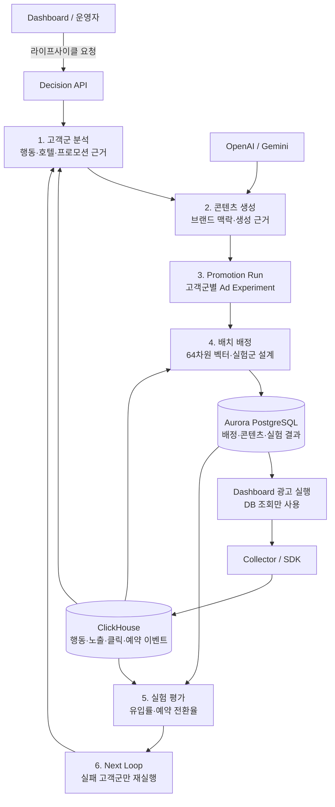

# loop-ad Decision API

> 고객군 분석부터 콘텐츠 생성, 실험 배정, 성과 평가, 다음 실험까지 연결하는 AI 마케팅 의사결정 서비스

`loop-ad Decision`은 숙박 탐색, 클릭, 예약 데이터를 바탕으로 고객군을 분석하고 콘텐츠를 생성하는 AI 마케팅 의사결정 서비스입니다. 실험 배정과 성과 평가는 API와 배치 작업으로 처리합니다. 의사결정 결과를 미리 계산해 저장하므로 광고 노출 시점에는 Decision API를 호출하지 않고 Dashboard가 저장된 결과를 조회합니다.

이 저장소는 다음 문제를 다룹니다.

- 행동 로그에서 프로모션에 반응할 가능성이 높은 고객군을 찾습니다.
- 고객군별 근거와 브랜드 맥락을 반영한 콘텐츠 후보를 생성합니다.
- 프로모션 실행과 광고 실험을 재시도해도 같은 결과가 유지되도록 관리합니다.
- 노출·클릭·예약 이벤트로 성과를 평가하고, 실패한 고객군만 다음 루프로 보냅니다.

## 오프라인 검증 성과

| 항목 | 결과 |
| --- | ---: |
| Expedia 전체 행동 로그 검증 규모 | 37,670,293건 |
| 검증 사용자 | 1,198,786명 |
| 전체 기준률보다 높은 고객군 후보 비율 | 90.70% |
| 유효 후보를 찾은 시나리오 비율 | 100% |
| 후보 평균 예약 전환율 향상 | +7.63%p |

Expedia 전체 행동 로그를 활용한 오프라인 평가에서 모든 시나리오의 유효한 고객군 후보를 찾았습니다. 후보의 90.70%가 전체 기준 예약률을 웃돌았으며, 후보 고객군의 평균 예약 전환율은 기준 대비 7.63%p 높았습니다. 평가 방법과 예측 오차를 포함한 전체 결과는 [검증 결과](#검증-결과)에서 확인할 수 있습니다.

## 아키텍처



Decision API는 **계산 결과를 쓰는 서비스**입니다. 배너 조회, 리다이렉트, 이메일·문자 발송처럼 사용자 요청의 지연 시간에 직접 영향을 주는 기능은 Dashboard가 소유합니다. 이 경계 덕분에 모델과 외부 생성 API의 응답 시간이 광고 서빙 경로에 전파되지 않습니다.

## 주요 기능

### 1. 근거 기반 고객군 분석

- 호텔 탐색, 클릭, 예약 시작·완료 신호를 64차원 행동 벡터로 표현합니다.
- 프로모션 의도와 고객 행동을 함께 사용해 고객군 후보를 만들고 우선순위를 계산합니다.
- 고객군 정의, 벡터, 표본, 선택 근거를 저장해 이후 생성과 실험이 같은 입력을 재사용하게 합니다.
- 과거 행동과 미래 예약 라벨을 시간 기준으로 분리해 오프라인 성능을 검증합니다.

### 2. 비동기 콘텐츠 생성

- 브랜드 컨텍스트와 고객군 근거를 결합해 이메일·SMS·온사이트 배너 후보를 만듭니다.
- 콘텐츠 생성 요청은 `202 Accepted`로 접수하고 DB 기반 coordinator가 처리합니다.
- `Idempotency-Key`, lease, heartbeat, 재시도 정책으로 중복 생성과 작업 유실을 방지합니다.
- 생성 원문, 프롬프트, 브랜드 자료, 이미지 결과에 SHA-256 메타데이터를 남겨 출처를 추적합니다.

### 3. 재현 가능한 프로모션 실험

- 한 프로모션 실행 안에서 고객군별 `ad_experiment`를 생성합니다.
- 정렬·중복 제거한 고객군 범위를 SHA-256 fingerprint로 고정해 동일 요청의 멱등성을 보장합니다.
- `all_treatment`와 결정적 `randomized_holdout` 실험 설계를 지원합니다.
- 실행 범위, 콘텐츠, 고객 배정, 평가 결과의 lineage를 PostgreSQL에 함께 저장합니다.

### 4. 대규모 고객 배정

- ClickHouse에서 고객 행동 벡터를 읽고 후보를 검색한 뒤 cosine similarity로 재정렬합니다.
- 최고 유사도가 실행 계약의 임계값보다 낮으면 fallback 정책을 적용합니다.
- 같은 `promotion_run_id + user_id`는 재시도해도 같은 배정을 유지합니다.
- 배정 결과에 고객군, 광고 실험, 콘텐츠 식별자를 함께 저장하므로 광고 실행 시 Decision 호출이 필요 없습니다.

### 5. 평가와 실패 고객군 재실행

- 광고 실험 단위로 유입률과 예약 전환율을 계산합니다.
- 분모가 0이거나 표본이 부족한 경우를 성공·실패와 분리해 기록합니다.
- 프로모션 전체를 `all_segments` 또는 `promotion_average` 기준으로 집계합니다.
- 다음 루프에는 목표를 달성하지 못한 고객군만 포함하고 성공한 고객군은 그대로 유지합니다.

## 핵심 API 흐름

| 단계 | API | 역할 |
| --- | --- | --- |
| 고객군 추천 | `POST /decision/v1/promotions/{promotion_id}/segment-suggestions/recommend` | 행동·호텔·프로모션 근거로 후보 고객군 생성 |
| 고객군 확정 분석 | `POST /decision/v1/promotions/{promotion_id}/analyses` | 확정 고객군과 벡터·근거 저장 |
| 콘텐츠 생성 | `POST /decision/v1/promotions/{promotion_id}/generation` | 비동기 콘텐츠 생성 접수 |
| 실행 생성 | `POST /decision/v1/promotions/{promotion_id}/runs` | Promotion Run과 Ad Experiment 생성 |
| 고객 배정 | `POST /decision/v1/promotion-runs/{promotion_run_id}/segment-assignments/build` | 벡터 기반 배치 배정 |
| 실험 평가 | `POST /decision/v1/ad-experiments/{ad_experiment_id}/evaluate` | 광고 실험 단위 성과 계산 |
| 실행 평가 | `POST /decision/v1/promotion-runs/{promotion_run_id}/evaluate` | 프로모션 실행 전체 성과 집계 |
| 다음 루프 | `POST /decision/v1/promotion-runs/{promotion_run_id}/next-loop` | 실패 고객군만 분석·생성·실험 재실행 |

`/internal/*` 엔드포인트는 `X-Loop-Ad-Internal-Key`를 검증합니다. 사용자 요청 시점의 단순 조회 API와 실시간 segment-match API는 의도적으로 제공하지 않습니다.

## 기술적 선택

| 문제 | 선택 | 이유 |
| --- | --- | --- |
| 모델 호출이 광고 응답 시간을 늘릴 수 있음 | Decision write path와 Dashboard serving path 분리 | 서빙 경로를 DB 조회만으로 유지 |
| 재시도 시 중복 실행이 생길 수 있음 | scope fingerprint와 DB unique constraint | 애플리케이션·DB 두 계층에서 멱등성 보장 |
| 전체 고객과 모든 고객군의 전수 비교 비용 | 후보 검색 후 cosine reranking | 대규모 배치 비용을 줄이면서 임계값 판정 유지 |
| 실험 배정이 실행마다 달라질 수 있음 | salt 기반 결정적 holdout | 재실행과 감사 시 같은 실험군 재현 |
| 생성 작업이 외부 API 장애에 취약함 | DB lease·heartbeat·bounded retry | 프로세스 재시작 후에도 작업 상태 복구 |
| 성공 고객군까지 반복하면 학습 비용이 낭비됨 | failed-only next loop | 이미 성과를 낸 고객군을 보존하고 실패 범위만 개선 |
| 최종 데이터에 맞춘 사후 조정 위험 | sealed manifest와 artifact hash | 평가 입력·코드·모델의 변경 여부를 감사 가능하게 유지 |

## 기술 스택

- **API·런타임:** Python 3.11+, FastAPI, Uvicorn, Pydantic
- **데이터:** Aurora PostgreSQL, ClickHouse, 64차원 행동 벡터
- **생성·AI:** OpenAI API, Gemini API
- **인프라:** Docker, AWS ECS, S3, GitHub Actions
- **관측·품질:** structlog 기반 JSON 로그, Pytest, sealed offline evaluation

## 프로젝트 구조

```text
app/
├── analysis/            # 고객군 추천, 64차원 벡터, 근거 리포트
├── generation/          # 비동기 콘텐츠·이미지 생성과 artifact 추적
├── decision/            # 실행 생성, 배정, 평가, next-loop
├── internal/            # 내부 배치 API
├── uplift/              # uplift 학습·검증 계약
├── main.py              # FastAPI 애플리케이션과 라우터 구성
└── server.py            # PORT 기반 0.0.0.0 서버 진입점
offline_evaluation/      # 봉인 평가와 외부 데이터셋 재검증
tests/                   # 서비스·저장소·API·계약 테스트
scripts/                 # 백필, 백테스트, 로컬 미리보기 도구
```

## 로컬 실행

### 사전 조건

- Python 3.11 이상
- 계약 스키마가 적용된 PostgreSQL과 ClickHouse
- 콘텐츠 생성을 실행하려면 OpenAI·Gemini API 키와 S3 접근 권한

이 서비스는 데이터 스키마를 소유하지 않습니다. 로컬 DB에는 별도의 Data Source Contract 스키마가 준비되어 있어야 합니다.

### Python으로 실행

```bash
python3.11 -m venv .venv
source .venv/bin/activate
pip install -e '.[dev]'

cp .env.example .env
# .env의 필수 연결 정보와 키를 로컬 값으로 교체합니다.

python -m app.server
```

정상적으로 기동되면 다음 요청이 HTTP 200을 반환합니다.

```bash
curl http://localhost:8080/health
```

### Docker Compose로 실행

`compose.yml`은 호스트의 PostgreSQL·ClickHouse에 연결하고 API를 `localhost:8081`에 노출합니다.

```bash
cp .env.example .env
# .env를 로컬 환경에 맞게 수정합니다.
docker compose up --build decision-api
curl http://localhost:8081/health
```

## 테스트

```bash
pytest -q
```

주요 테스트 범위는 다음과 같습니다.

- Promotion Run과 Ad Experiment 생성 및 멱등성
- 64차원 벡터 검증, cosine matching, fallback
- 안정적인 고객 배정과 randomized holdout 재현성
- 유입률·예약 전환율·표본 부족 처리
- 성공 고객군 제외와 failed-only next loop
- 금지된 실시간 서빙 API와 공개 용어 경계
- 생성 요청의 멱등성, lease, heartbeat, artifact 무결성

## 검증 결과

### Expedia 전체 원본 봉인 평가

2026-07-15에 Kaggle Expedia Hotel Recommendations의 `train.csv` 전체를 ClickHouse에 적재하고 평가했습니다.

| 데이터 | 규모 |
| --- | ---: |
| 행동 로그 | 37,670,293건 |
| 사용자 | 1,198,786명 |
| 예약 행 | 3,000,693건 |
| 관찰 기간 | 2013-01-07 ~ 2014-12-31 |

2013년 행동으로 학습 데이터를 만들고, 2014년 데이터로 개발 검증을 수행했습니다. 최종 평가는 개발 목적지와 겹치지 않는 2014년 7~12월의 18개 목적지 시나리오를 먼저 봉인한 뒤 한 번 실행했습니다.

| 지표 | 결과 | 사전 기준 | 판정 |
| --- | ---: | ---: | --- |
| 전체 기준률보다 높은 후보 비율 | 90.70% | 60% 이상 | 통과 |
| 유효 후보를 찾은 시나리오 | 100% | 70% 이상 | 통과 |
| 모든 후보가 기준률을 넘은 시나리오 | 80% | 50% 이상 | 통과 |
| 후보 평균 향상 | +7.63%p | 0%p 이상 | 통과 |
| 최저 후보 평균 향상 | +4.95%p | 0%p 이상 | 통과 |
| 예상 전환율 편향 | +0.71%p | 절댓값 1.5%p 이하 | 통과 |
| 예상 전환율 평균 절대오차 | 4.63%p | 3.5%p 이하 | **실패** |
| Brier skill score | 0.0063 | 0 초과 | 통과 |

고객군 선택 성능은 사전 기준을 통과했습니다. 다만 전환율 예측의 평균 절대오차는 4.63%p로 사전 기준인 3.5%p 이하에는 미달했습니다. 따라서 이 결과는 유망한 고객군의 우선순위를 정하는 근거로는 해석할 수 있지만, 절대 전환율을 정밀하게 예측하는 용도로는 기준을 충족하지 못했습니다.

<details>
<summary>평가 재현성 정보</summary>

- 사용자 추가 표본 추출: 없음 (`user_sample_modulo=1`)
- 원본 fingerprint: `6e779cce23d70b54e9733784688f2a9224803b76d0eb98e6c02cd7af15ba5f75`
- manifest: `0b02550d60ee50ba54eb25aba6f1fb83cf654df11f2bb0047553b9e8063fc692`
- 실행 코드: `8f798ab1f40fa9322970a4365a73515ddae391c0`
- 모델 SHA-256: `30312e413c5520e28aa0c2c08c89350224df9cf8a7e2cf22c3b88aad9cee6aab`
- 최종 평가 이후 기준·모델 재조정: 없음

과거의 결정적 1% 사용자 표본 실행은 전체 원본 평가로 간주하지 않고 감사 기록으로만 보존합니다.

</details>

### 외부 데이터셋 재검증

Expedia 전체 원본으로 학습한 모델을 고정한 뒤 서로 다른 결과 계약을 가진 외부 데이터셋에 적용했습니다.

| 데이터셋 | 판정 | 관측 시나리오 | 후보 평균 향상 | 해석 |
| --- | --- | ---: | ---: | --- |
| Airbnb | 통과 | 1 | +1.04%p | 첫 예약 사용자 농축 여부만 검증 가능 |
| Booking.com | 통과 | 3 | +8.73%p | 3개 중 2개 시나리오에서 기준률 초과 |
| Synerise | 판단 유보 | 2 | +3.29%p | 최소 3개 관측 기준 미달 |

외부 데이터셋마다 결과 정의가 다르므로 Expedia의 예약 전환율 오차와 직접 비교하지 않습니다. 이 결과는 후보 고객군 농축 여부를 확인하는 보조 근거이며, 숙박 예약 전환율 모델의 일반화를 최종 증명하지는 않습니다.

## 운영 경계

- 계약 용어로 이 서비스는 `lifecycle write API`이며 `Decision hot path`가 아닙니다.
- 서버는 `PORT`를 읽고 `0.0.0.0:${PORT}`에 바인딩합니다.
- `/health`는 정상 상태에서 HTTP 200을 반환합니다.
- 필수 환경 변수가 없거나 잘못되면 트래픽을 받기 전에 실패합니다.
- `/internal/*`는 `X-Loop-Ad-Internal-Key`를 검증합니다.
- 비밀값과 인증 정보는 로그에 남기지 않습니다.
- 데이터베이스 스키마와 광고 서빙용 view는 Data Source Contract가 소유합니다.
- Dashboard는 배정·콘텐츠·실험 결과를 DB에서 직접 읽으며 Decision을 동기 호출하지 않습니다.

Decision does not provide active_ad_serving_assignments. 해당 광고 서빙 view는 Data Source Contract가 소유하고 Dashboard가 읽습니다.

초기 `B6 next-loop`는 실제 분석·생성 adapter 연결을 `follow-up integration PR`로 분리했지만, 현재 `dev` 구현은 실패 고객군의 분석·생성·실행 연결을 서비스 내부에서 수행합니다.

Promotion Run 응답 계약은 [`docs/contracts/decision-promotion-run-response.v1.json`](docs/contracts/decision-promotion-run-response.v1.json), uplift 학습 구조는 [`docs/uplift_modeling_architecture.md`](docs/uplift_modeling_architecture.md)에서 확인할 수 있습니다.
