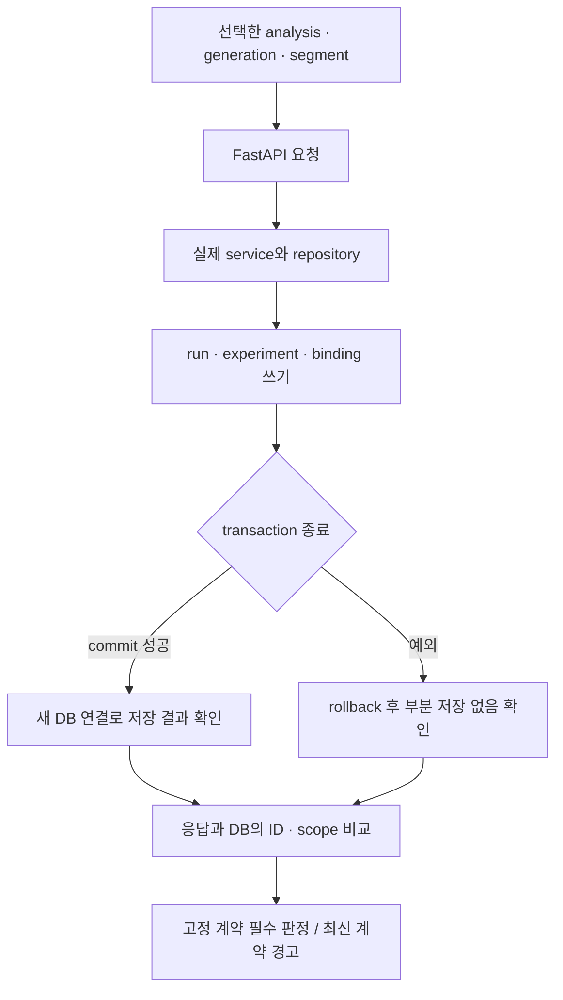
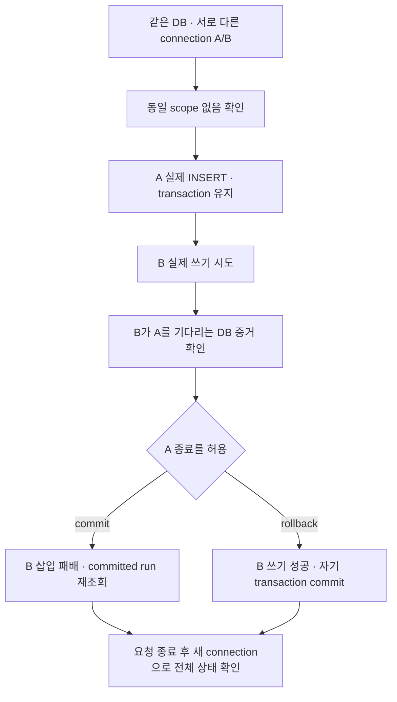
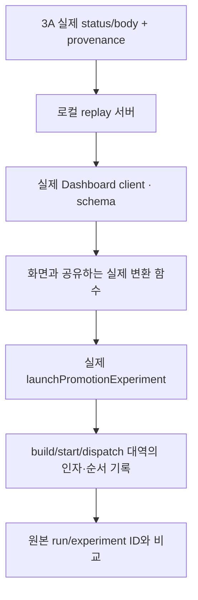

# Run Contract Gate 학습 안내

| 항목 | 내용 |
|---|---|
| 대상 독자 | 설계를 이해하고 자신의 말로 설명하려는 개발자 |
| 상태 | PR 0·1·2 개인 통합 병합 완료 · PR 2 CI PASS · PR 3A/3B 계획 확정, 미구현 |
| 기준 revision | 문서 기반 14e54cda5c4e92cf835a6ddffc5c20bac0d4ea1e / baseline e1de8b2 / Contract 0ec2cef0290f4659ad21ccc1dd2a20df2801ff50 |
| 마지막 확인 | 2026-09-19 KST |

한 번에 전체 service 파일을 읽지 않는다. 각 단원의 작은 조각을 읽고 입력·출력·부작용을 세 문장으로 설명한다. 해설을 읽기 전에 질문에 답한다. 아래 일반 실패 상황은 설명을 위한 가정이다. 다만 2026-09-19 RCG-07에서 HTTP 200 이후 commit 실패가 실제로 재현됐으며, 운영 사고라는 의미는 아니다.

이 문서의 코드 조각은 현재 코드에서 발췌하거나 생략한 것이다. 실제 파일을 함께 읽는다. 초기 실패는 E-09, PR 0 병합과 전체 로컬 결과는 [E-11/E-12](evidence-log.md#e-11-pr-0-병합과-pr-1-기반-반영)에 기록했다.

## 전체 흐름

이 그림은 구현 완료된 PR 1·2의 경계다. PR 3A 실제 경합과 PR 3B consumer 연결 계획은 7~9장에서 따로 설명한다. TestClient는 프로세스 내부의 HTTP 요청 경로를 검사하며 ALB·TCP·배포 서버까지 실행하지 않는다.

## 1. Fake 테스트와 실제 DB 테스트

### 실패 예시

repository fake는 Python 객체를 정상적으로 저장하지만, 실제 INSERT는 column 이름이나 타입·제약 때문에 실패할 수 있다. fake가 통과했다는 사실만으로 실제 DB의 동작을 알 수 없다.

### 읽을 코드와 테스트

[test_decision_run_service.py](../../tests/test_decision_run_service.py)의 make_service(2430행)와 동일 scope 테스트(458행), [test_decision_run_api.py](../../tests/test_decision_run_api.py)의 commit 테스트(220행)를 읽는다.

    # 기존 service fixture의 핵심
    repos = FakeRepositoryBundle(...)
    return PromotionRunService(...), repos

    # 기존 API wiring 테스트의 핵심
    monkeypatch.setattr(
        "app.decision.router.create_postgres_connection",
        fake_create_postgres_connection,
    )

두 번째 테스트는 FastAPI를 거치지만 connection은 RecordingConnection이다. 실제 DB 테스트인지 여부는 이름이나 TestClient 존재만으로 판단하지 않는다.

### 설명

fake는 입력에 따른 분기·반환값·호출을 빠르게 확인하기 좋다. 실제 DB는 SQL 실행, 타입 변환, 제약, transaction 결과를 확인한다. 둘은 대체 관계가 아니라 서로 다른 실패를 잡는 검사다. 기존 lean integration도 실제 DB를 사용하지만 run API 호출 대신 직접 SQL INSERT를 사용한다.

### 이해 확인 질문

1. commit_count가 1이면 실제 데이터가 저장됐다고 말할 수 있는가?
2. 이번 Gate에서 바꿔야 할 부분과 유지해야 할 부분은 무엇인가?

### 해설

1. RecordingConnection의 호출 횟수일 뿐이므로 실제 persistence 근거가 아니다.
2. 새 integration에서는 실제 connection·service·repository를 사용한다. 기존 unit 테스트는 빠른 분기 검증으로 유지한다.

## 2. Run·experiment·scope·fingerprint

### 실패 예시

A/B와 B/A를 다른 요청으로 취급하면 같은 고객군에 run이 중복될 수 있다. 반대로 A와 B의 요청을 같은 run으로 돌려주면 요청하지 않은 고객군의 광고를 실행할 수 있다.

### 읽을 코드와 테스트

[service.py](../../app/decision/service.py)의 build_segment_scope_fingerprint(1502행), build_promotion_run_id(1454행), [scope 테스트](../../tests/test_decision_run_service.py)의 458~545행을 나누어 읽는다.

    # 실제 fingerprint 계산의 핵심
    serialized = json.dumps(
        sorted(
            segment_id
            for segment_id in set(segment_ids)
            if segment_id != FALLBACK_SEGMENT_ID
        ),
        ensure_ascii=False,
        separators=(",", ":"),
    )
    return hashlib.sha256(serialized.encode("utf-8")).hexdigest()

### 설명

scope는 선택한 고객군의 집합이다. 순서·중복에 영향을 받지 않는 표현을 hash로 바꾼 것이 fingerprint다. 하지만 fingerprint만 같다고 같은 run은 아니다. project·promotion·analysis·generation·loop도 identity에 들어간다.

DB는 composite UNIQUE로 같은 scope의 중복 run을 막는다. experiment는 run+segment를 연결한다. V2 binding은 target이 어떤 immutable snapshot·allocation을 소비했는지 연결한다.

같은 analysis+segment를 두 run에 중복 binding할 수 없다는 제약도 있다. 따라서 A로 run을 만든 뒤 A/B를 요청하는 상황은 단순한 “다른 scope 성공” 예시로 쓰면 안 된다.

### 이해 확인 질문

1. 같은 A/B라도 generation이 다르면 반드시 같은 run인가?
2. UUID처럼 매번 새 ID를 생성하면 retry 안전성이 생기는가?
3. 다른 scope 성공 테스트에 왜 서로 겹치지 않는 고객군을 사용하는가?

### 해설

1. generation도 identity의 일부이므로 아니다.
2. 매번 새 ID는 오히려 중복을 감출 수 있다. 안정된 scope identity·DB UNIQUE·재사용 로직을 함께 봐야 한다.
3. 이미 bound된 target의 재사용 금지와 scope 구분을 섞지 않기 위해서다. 중복 binding 거절은 RCG-09에서 별도로 검증한다.

## 3. 재시도와 실제 동시성

### 실패 예시

첫 요청은 commit했지만 사용자가 응답을 받지 못해 같은 요청을 다시 보낸다. 또 다른 상황에서는 두 요청이 동시에 기존 run이 없다고 읽고 INSERT를 시도한다. 두 상황은 같지 않다.

### 읽을 코드와 테스트

[service.py](../../app/decision/service.py)의 243~260행과 295~317행, [기존 race 분기 테스트](../../tests/test_decision_run_service.py)의 556행을 읽는다.

    inserted = self._promotion_run_repository.insert_if_absent(run)
    if not inserted:
        concurrent_run = self._promotion_run_repository.get_by_scope(...)
        # 존재와 identity를 확인한 뒤 기존 run 재사용

### 설명

순차 재시도는 이미 commit된 row를 다시 읽는 경로를 확인한다. 실제 동시성은 두 transaction의 관측 시점, unique 충돌, lock 대기, 승자 commit과 패자 재조회까지 관련된다.

기존 fake race 테스트는 삽입 패배 이후 코드 분기를 검증하지만 실제 PostgreSQL transaction의 실행 순서를 만들지는 않는다. 이번 RCG-02는 첫 번째 상황을 다룬다. 두 번째 상황은 PR 3A의 필수 구현 계획이며 아직 검증하지 않았다.

### 이해 확인 질문

1. 같은 API를 두 번 순서대로 호출해 성공하면 동시 요청 안전성도 증명되는가?
2. ON CONFLICT DO NOTHING 한 줄만 보고 race가 해결됐다고 말할 수 있는가?

### 해설

둘 다 아니다. 실제 복수 connection의 경합과 패자 재조회 결과를 관찰해야 한다. 이 한계를 명시하는 것은 구현의 가치를 낮추는 일이 아니라 증거의 범위를 정확히 설명하는 일이다.

## 4. Statement·commit·rollback·지연 제약

### 실패 예시

run과 experiment INSERT는 성공했지만 V2 binding이 빠져 있다. 제약이 transaction 끝까지 미뤄졌다면 INSERT 시점에는 성공하고 commit에서 실패할 수 있다.

### 읽을 코드와 테스트

[router.py](../../app/decision/router.py)의 get_promotion_run_service(180~206행), [lean integration](../../tests/test_lean_audience_contract_integration.py)의 SET CONSTRAINTS 및 마지막 rollback, [canonical binding trigger](https://github.com/krafton-jungle-project-4team/loop-ad_data-source_contract/blob/0ec2cef0290f4659ad21ccc1dd2a20df2801ff50/postgres/schema.sql#L2958)를 읽는다.

    try:
        yield PromotionRunService(...)
        connection.commit()
    except Exception:
        connection.rollback()
        raise
    finally:
        connection.close()

### 설명

service가 반환됐다는 것과 transaction이 commit됐다는 것은 다르다. 같은 connection 안에서 row가 보이는 것도 다른 연결이 commit 결과를 읽을 수 있다는 뜻은 아니다.

Gate는 실제 dependency를 유지하고 요청 완료 후 별도 connection으로 확인한다. 실패 주입은 실제 쓰기 뒤 예외를 발생시키거나 binding을 생략해 실제 제약 실패를 만들되, production 동작을 바꾸는 flag를 추가하지 않는다.

### 이해 확인 질문

1. 테스트 전체를 바깥 transaction으로 감싸 마지막에 rollback하면 무엇을 놓칠 수 있는가?
2. run row만 사라졌으면 rollback 검증은 충분한가?

### 해설

1. 실제 요청의 commit 및 commit 시점 지연 제약의 실패를 관찰하지 못할 수 있다.
2. experiment·binding뿐 아니라 target/plan/exclusion 상태가 seed 상태로 복구됐는지도 확인해야 한다.

## 5. 기존 row fixture와 현재 writer

### 실패 예시

새 writer와 새 reader가 같은 잘못된 규칙을 공유한다. 테스트가 새 writer로 데이터를 만들고 새 reader로 읽으면 둘이 같은 방식으로 틀려도 통과할 수 있다.

### 읽을 코드와 테스트

[service.py](../../app/decision/service.py)의 _reuse_existing_run(363행)과 _validate_existing_run_integrity, [명세의 fixture 절차](verification-spec.md#기존-row-fixture)를 읽는다.

    ad_experiments = repository.list_by_run(run.promotion_run_id)
    self._validate_existing_run_integrity(run, ad_experiments)
    # V2인 경우 실제 binding 집합도 확인

### 설명

고정 fixture는 “예전처럼 보이는 JSON”이 아니다. 어느 Decision·DDL·의존성으로 어떤 요청을 실행해 생성한 row인지 provenance가 있어야 한다.

첫 baseline을 지금 코드로 만들더라도 고정해두면 다음 변경의 reader가 이전 데이터와 호환되는지 검사할 수 있다. 초기에는 현재와 baseline이 같다는 사실을 숨기지 않는다. 이 검사는 전체 migration 검증과 다르다.

### 이해 확인 질문

1. 테스트가 실패할 때마다 fixture를 새 코드로 다시 생성해도 되는가?
2. fixture가 과거 SHA에서 생성됐다는 것만으로 모든 과거 상태를 지원한다고 말할 수 있는가?

### 해설

1. 그러면 변화의 증거를 지울 수 있다. 기존 fixture를 보존하고 실패를 분석해야 한다.
2. 아니다. 이 첫 fixture가 실제 담은 생성 직후 상태와 source 경로에 한정된다.

## 6. 고정 계약·의존성과 최신 경고

### 실패 예시

Decision 코드는 바꾸지 않았는데 외부 Contract main이나 Python dependency가 바뀌어 검사가 실패한다. 이때 코드 회귀와 환경/계약 변경을 구분하지 못하면 개발자가 도구를 믿기 어렵다.

### 읽을 코드와 정의

[pyproject.toml](../../pyproject.toml)의 dependency 하한, [Dockerfile](../../Dockerfile)의 설치 방식, [판정표](verification-spec.md#결과-판정)를 읽는다.

    fixed: 변경을 평가하는 고정 기준 → 필수
    latest: 외부 변화의 조기 확인 → 경고
    lock/image digest: 검증 환경의 재현 기준

### 설명

같은 컨테이너 태그를 사용해도 image나 설치 dependency가 달라질 수 있다. Gate용 lock과 image digest를 고정하고 revision을 결과에 남긴다. 운영 이미지 전체의 동일성을 보장하는 것은 아니다.

최신 검사의 PASS는 고정 기준을 자동 변경하라는 뜻이 아니다. 별도 기준 갱신 PR에서 DDL diff와 보존된 기존 row의 호환성을 검토한다.

### 이해 확인 질문

1. fixed PASS + latest WARN_DRIFT의 의미는 무엇인가?
2. latest 다운로드 실패를 “최신 계약과 호환됨”이라고 표시해도 되는가?
3. PR check가 추가되면 배포가 자동으로 차단되는가?

### 해설

1. 고정 기준에서는 통과했고 최신 변경에 대한 주의가 필요하다는 뜻이다.
2. 아니다. WARN_UNVERIFIED로 남겨야 한다.
3. 아니다. 이번에는 deploy workflow와 branch protection을 연결하지 않는다.

## 학습 완료 확인

아래를 코드와 연결해 자신의 말로 설명한다.

- 기존 테스트의 정확한 공백과 새 Gate의 추가 보장.
- 동일 scope 재사용과 V2 target 중복 binding 금지의 차이.
- 실제 commit 결과를 관찰하는 방법.
- 고정 fixture를 바꾸지 않아야 할 이유.
- 구현 완료된 PR 1·2와 계획 단계인 PR 3A/3B, 운영 경험의 차이를 설명하는 방법.

답을 외우기보다 “어떤 변경을 넣으면 어느 RCG case가 실패해야 하는가”를 예측한다. 실제 실행 후 예상과 결과가 달랐던 지점은 근거 기록에 추가한다.

## 이번 재현과 함께 읽기

1장과 4장을 먼저 읽고 [test_run_db.py](../../tests/run_contract_gate/test_run_db.py)를 본다. 정상 요청은 commit된 row가 새 연결에서 보였다. binding을 생략한 실패 요청은 실제 INSERT를 수행했지만 commit 시 deferred constraint가 거절했고 row와 상태가 원래대로 돌아왔다. 그런데 HTTP 200과 body는 이미 전송돼 있었다.

`TestClient(raise_server_exceptions=True)`만 사용하면 CheckViolation 예외가 보이므로 이 응답 문제를 놓칠 수 있다. RCG-07은 `False`로 HTTP 응답을 확인하고, 외부 ASGI wrapper가 응답 전송·실제 예외 순서를 기록한다. wrapper는 connection이나 commit을 대체하지 않는다.

확인 질문: “DB가 정상적으로 rollback됐는데 왜 테스트가 실패해야 하는가?” 답은 클라이언트가 받은 성공 응답과 저장 결과가 모순되기 때문이다. 서비스 수정 시 commit 성공을 확인한 뒤 성공 응답을 전송하도록 트랜잭션 경계를 검토해야 한다.

## 구현 후 따라 읽을 코드

- 1·2·3장: [DB 시나리오](../../tests/run_contract_gate/test_run_db.py)의 정상·retry·scope·겹침 거절을 비교한다. rollback 관찰에는 exclusion revision도 포함한다.
- 4장: PR 0 #394가 POST /runs의 dependency를 function scope로 바꿨다. commit 예외가 나면 성공 응답 전에 실패하고, RCG-07은 HTTP 500·SQLSTATE 23514·전체 rollback을 확인한다. 과거 baseline 재현은 계속 실패한다.
- 5장: [baseline 복원](../../tests/run_contract_gate/baseline.py)과 [provenance](../../tests/fixtures/run_contract_gate/baseline/provenance.json)를 읽는다. 왜 locked/consumed 행을 바로 INSERT할 수 없는지, before/after 행으로 lifecycle을 거친 뒤 전체 동등성을 확인하는 이유를 설명한다.
- 6장: [판정기](../../tools/run_contract_gate/report.py)와 [제어 검사](../../tests/run_contract_gate/test_runner_control.py)를 읽는다. pytest exit 0이어도 skip/xfail/xpass/필수 누락이 있으면 왜 INCOMPLETE인지 확인한다.

추가 질문: Docker CLI에 종료 신호를 보냈다는 사실이 컨테이너 종료의 증거인가? 아니다. 신호 대기도 제한하고, host가 이번 실행의 이름과 소유 label을 대조해 컨테이너·socket volume을 정리해야 한다. 실제 timeout 주입에서 이 차이를 확인했다.

## 7. PR 3A: 동시 시작과 실제 경합은 다르다

### 실패 예시

두 worker를 동시에 시작했지만 A가 모두 끝난 뒤 B가 DB에 도착할 수 있다. 둘 다 같은 run을 받았어도 이는 순차 재사용 검증일 수 있다. 반대로 A가 lock을 잡은 채 B의 도착을 기다리고 B는 그 lock 때문에 도착하지 못하면 테스트가 스스로 교착을 만든다.

### 따라 읽기

[기존 RCG-02](../../tests/run_contract_gate/test_run_db.py)의 순차 요청과 [insert_if_absent](../../app/decision/repositories.py)의 실제 `ON CONFLICT DO NOTHING`을 비교한다. 다음 그림은 PR 3A에서 만들 **예정 순서**이지 현재 실행 결과가 아니다.

### 설명

barrier는 실행 순서를 제어하고, PostgreSQL 관찰은 실제 경합을 증명한다. 둘이 같은 역할은 아니다. DB 대기를 확인하기 전 요청이 끝나면 의도한 case가 성립하지 않았으므로 INCOMPLETE다. 대기를 확인했고 결과가 잘못됐으면 불변식 실패다. 재시도 횟수를 늘려 우연히 성공한 결과만 고르지 않는다.

rollback case의 최종 run 수는 0이 아니라 1일 수 있다. A가 실패한 뒤 B가 정상 생성했기 때문이다. “rollback했으니 모든 row가 0”이라는 assertion 대신 A의 부분 쓰기가 없고 B의 완전한 결과만 남았는지 확인한다.

### 이해 확인과 해설

1. 두 요청의 시작 시각이 같으면 충분한가? **아니다.** 서로 다른 backend PID와 실제 blocker/wait·종료 순서가 필요하다.
2. A 실패 후 B 성공인데 run이 1개면 rollback 실패인가? **아니다.** 최종 row의 identity·binding·소비 상태가 B의 성공과 일치하는지 본다.
3. `sleep(1)`을 늘려 테스트가 통과하면 해결인가? **아니다.** 준비 순서와 대기 증거를 확정하고 모든 대기에 종료 제한을 둬야 한다.

## 8. PR 3B: 실제 consumer 코드를 사용한다는 뜻

### 실패 예시

테스트가 Dashboard 변환 로직을 복사해 올바른 `promotionRunId`를 만들지만 화면의 실제 hook에는 오타가 남을 수 있다. client schema만 통과해도 이후 launch가 scope를 거절하거나 잘못된 experiment ID를 보낼 수 있다.

### 따라 읽기

[개발 계획 10절](implementation-plan.md#10-dashboard-소비-코드-연결-방식)의 실제 client, hook, launch 코드 순서로 읽는다. 현재 변환은 hook 안에 있으므로 PR 3B에서 공유 순수 함수로 추출하고 화면과 테스트가 함께 사용하게 할 계획이다. 함수 추출은 구현 예정이며 아직 적용하지 않았다.

### 설명

이 검사는 실제 DB가 만든 응답을 실제 consumer가 사용할 수 있는지 확인한다. replay 서버는 고정된 원본 status/body를 제공한다. downstream 대역은 launch가 어떤 요청을 만들었는지 관찰한다. 둘 다 경계를 명확하게 제한하기 위한 것이며, 실제 client·변환·launch를 통째로 fake로 바꾸는 것과 다르다.

브라우저, Dashboard API 전체 proxy 경로, 실제 assignment·start·발송은 이 그림에서 실행하지 않는다. 따라서 정확한 이름은 run-consumer 통합 검증이다. 예를 들어 dispatch 대역이 한 번 호출됐다는 사실은 이메일이 전송됐다는 증거가 아니다.

### 이해 확인과 해설

1. 테스트와 화면이 같은 코드를 쓴다는 것은 어떻게 보장하는가? **공유 함수 하나를 실제 hook과 연결 검사에서 사용하고 wiring·기존 회귀도 확인한다.** 테스트에 변환을 복제하지 않는다.
2. 원본 응답을 Dashboard 타입에 맞게 고쳐서 연결해도 되는가? **안 된다.** 실제 불일치를 숨긴다. 오류 검사용 변형은 별도 파생 입력으로 표시한다.
3. schema 검사가 통과하면 소비 검증은 끝인가? **아니다.** 변환 후 scope와 다음 operation의 ID까지 확인한다.

## 9. 두 PR의 PASS와 하나의 milestone

### 실패 예시

Decision D1의 bundle을 Dashboard H1이 읽고 PASS했다. 이후 Decision을 D2로 바꿨는데 H1의 과거 PASS를 그대로 붙이면 D2/H1 조합은 검증하지 않은 상태다. PR 번호가 같아도 commit이 바뀔 수 있다.

### 설명

milestone은 PR 두 개의 체크 표시를 모은 것이 아니라 **특정 producer·consumer·Contract 조합의 증거**다. PR 번호는 작업 위치를 찾는 링크이고 실제 checkout SHA·source digest·bundle hash는 무엇을 검사했는지 확인하는 값이다.

- Decision SHA: 어떤 코드가 응답을 만들었는가.
- Contract SHA/DDL hash: 어떤 DB 계약에서 만들었는가.
- bundle/response hash: Dashboard가 어떤 bytes를 소비했는가.
- Dashboard SHA: 어떤 client·변환·launch가 소비했는가.
- 결과/CI 링크: 그 조합이 어떻게 끝났는가.

같은 SHA로 다시 실행해도 run ID·시각·bundle hash는 달라질 수 있다. 새 실행을 소비했다면 그 새 artifact를 연결해야 한다. 과거 baseline expected는 별도로 보존해 현재 writer·reader가 함께 같은 방식으로 틀리는 것을 감시한다.

### 이해 확인과 해설

1. 3A PASS, 3B PASS인데 bundle hash가 다르면 milestone PASS인가? **그 두 결과의 연결을 증명하지 못했다.** 맞는 입력으로 소비 검증을 다시 하거나 정확한 실행 관계를 찾아야 한다.
2. 3A만 완료했으면 어떻게 적는가? **`3A verified / 3B pending`.** 전체 PR 3 완료라고 쓰지 않는다.
3. PR 3 verified면 merge·배포도 승인됐는가? **아니다.** 검증 상태와 원격 작업 승인은 별개다.

다 읽은 뒤 [E-16 대장](evidence-log.md#e-16-pr-3-milestone-결정과-증거-대장)의 한 조합을 보고 “누가 무엇을 만들어서 누가 어떻게 읽었는가”를 설명할 수 있어야 한다. 아직 값이 비어 있는 것은 문서 누락이 아니라 미구현 상태를 명시한 것이다.
