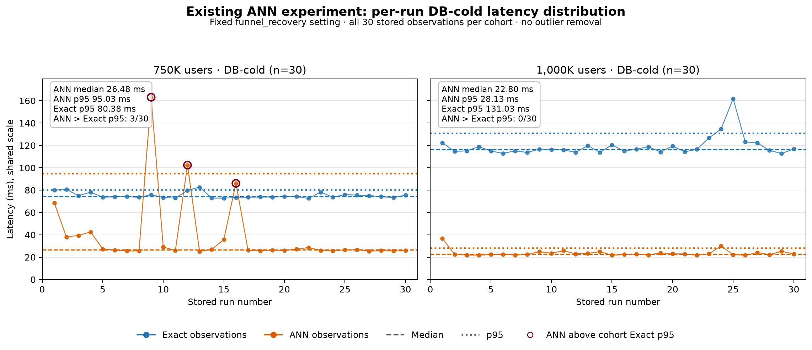

# DB-cold tail latency reanalysis

This is a local reanalysis of the existing measurements, not a new benchmark.
It uses only the fixed `funnel_recovery`, K=500, ef=200, relaxed-order,
20K-scan confirmation cell and retains every one of the 30 stored DB-cold runs
at both 750K and 1M users.

| Cohort | ANN median | ANN p95 | ANN max | Exact p95 | ANN / Exact p95 | ANN above cohort Exact p95 |
|---:|---:|---:|---:|---:|---:|---:|
| 750K | 26.48 ms | 95.03 ms | 163.11 ms | 80.38 ms | 1.182 | 3/30 |
| 1M | 22.80 ms | 28.13 ms | 36.81 ms | 131.03 ms | 0.215 | 0/30 |

At 750K, three stored ANN runs exceeded that cohort's Exact p95; those observed
slow runs lift ANN p95 above Exact p95 and connect directly to the DB-cold gate
failure. At 1M, no ANN run exceeded that cohort's Exact p95. This does not show
that scale itself made ANN faster, nor does it identify whether cache state,
memory, index placement, execution order, or another system effect caused the
750K slow runs.

The separately calculated same-iteration comparison is also 3/30 at 750K and
0/30 at 1M in these observations. It remains a different metric: it compares
each ANN run with its paired Exact run, whereas the count above compares every
ANN run with the cohort-level Exact p95 threshold.

The measurement-time warm gate and DB-cold gate are distinct. The warm final
gate requires quality and operational checks, ANN/Exact p95 and bootstrap upper
bounds at or below 0.70, and ANN p99 no slower than Exact p99. The DB-cold join
requires 30 runs, ANN p95 no slower than Exact p95, HNSW index use, Exact not
using HNSW, and no spill or OOM. Here, “DB-cold” means the existing runner's
PostgreSQL restart procedure; it does not claim that OS or disk caches were
cleared.

The previously reported 16.3x result is the 1M **warm** candidate-retrieval p95
speedup. The figure above instead shows the 30-run **DB-cold** distributions.
For the measured cohorts and this fixed setting, 1M was the first point to pass
both the warm and DB-cold final criteria. These 30-run p95 and maximum values do
not establish general service tail latency, and the full-membership failure and
Exact fallback policy remain unchanged.
